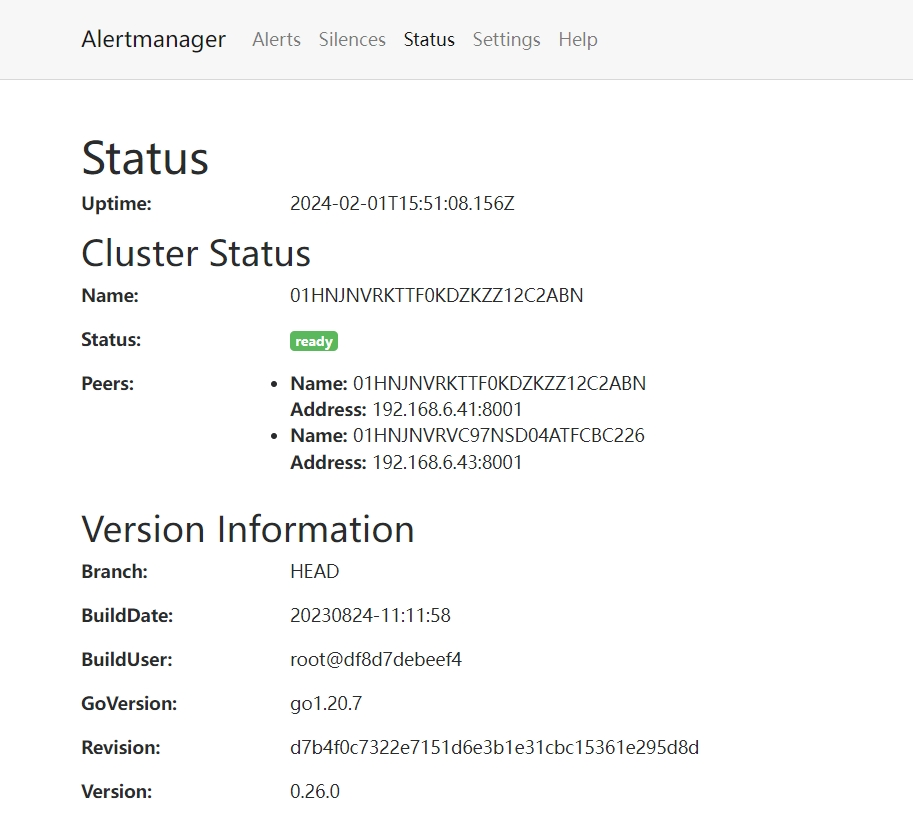

# alertmanager三节点高可用集群

1. 在hosts文件中按照格式填入ip地址

2. 修改roles\alertmanager_cluster\files\am1\alertmanager.service中的配置项：

   ```bash
[Unit]
   Description=alertmanager service
[Service]
ExecStart=/usr/local/alertmanager/alertmanager --config.file alertmanager.yml --cluster.listen-address 192.168.6.42:8001 --cluster.peer 192.168.6.41:8001
ExecReload=/bin/kill -HUP $MAINPID
KillMode=process
Restart=on-failure
[Install]
WantedBy=multi-user.target
```

--cluster.listen-address是本机alertmanager的监听地址，--cluster.peer是集群master的地址

4. 进入master的ui界面，查看集群是否正常启动


